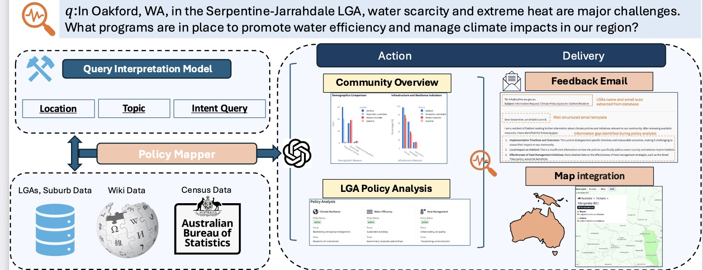

[](https://doi.org/10.5281/zenodo.14807376)
# CLEAR: Climate Policy Retrieval and Summarization Using LLMs ((WWW Companion '25))

---

_Figure: Climate Policy Navigator: Mapping Australia's Environmental Policy Data_


CLEAR is a system that bridges the information gap between rural communities and local governments on climate policies through:
- Query analysis using fine-tuned Llama-3.2-3B
- Policy retrieval from authoritative government documents  
- Multi-modal summarization with geospatial visualizations
- Automated feedback generation for policy gaps

## Installation

Using [UV](https://docs.astral.sh/uv/getting-started/installation/):
```bash
uv venv --python 3.10
source .venv/bin/activate
uv sync
```


## Dataset 
The action delivery module processed decomposed resident queries ($L,I,T$) to genreate reports utilized two source data: $S$ (ABS cnesus, Wikipedia) and $D$ for policy documents.

- The $S$ for local government can be found [db_lga.csv)](data/db/db_lga.csv), and suburb data in [db_suburb.csv)](data/db/db_suburb.csv). 

** Note that there are two versions of the Census data link; for this study, we use 
the 2021 Census URL.

- For each validated LGA, we searched its official website to identify climate policy PDFs $D$. To download them, run:

```bash
uv run prepare_policy.py
# or
python prepare_policy.py
```
The default saving directory is `./data/pdf_lga`.


Collected Data Summary:
- LGAs (362 entries)
- Suburbs (11,276 entries)
- Policy Documents (710 entries)
#### Suburb Schema
| Key                 | Value                                                                                               |
|---------------------|---------------------------------------------------------------------------------------------------|
| _id                | SAL51174                                                                                           |
| Area Code: 2016    | SSC51164                                                                                           |
| Census URL 2016    | [Census 2016](https://www.abs.gov.au/census/find-census-data/quickstats/2016/SSC51164)              |
| Census URL 2021    | [Census 2021](https://abs.gov.au/census/find-census-data/quickstats/2021/SAL51174)                 |
| sal_id             | SAL51174                                                                                           |
| Suburb             | Oakford                                                                                           |
| Postcode           | 6121                                                                                              |
| State              | WA                                                                                                |
| State Name         | Western Australia                                                                                 |
| Type               | Rural locality                                                                                   |
| LGA                | Serpentine-Jarrahdale                                                                             |
| Statistic Area     | Greater Perth                                                                                    |
| Elevation          | 22                                                                                                |
| Area (sqkm)        | 46.91                                                                                            |
| Latitude           | -32.20852                                                                                        |
| Longitude          | 115.92797                                                                                        |
| Timezone           | Australia/Perth                                                                                  |
| Government Level   | State suburbs                                                                                    |

---

####  LGA Schema
| Key                 | Value                                                                                              |
|---------------------|---------------------------------------------------------------------------------------------------|
| _id                | LGA57700                                                                                          |
| lga_id             | LGA57700                                                                                          |
| LGA                | Serpentine-Jarrahdale                                                                             |
| Government Level   | lga                                                                                               |
| LGA Type           | mixed                                                                                            |
| Government URL     | [Website](https://www.sjshire.wa.gov.au/)                                                        |
| Government Email   | info@sjshire.wa.gov.au                                                                           |
| State Name         | Western Australia                                                                                 |
| Census URL 2021    | [Census 2021](https://www.abs.gov.au/census/find-census-data/quickstats/2021/LGA57700)            |
| State              | WA                                                                                                |
| Number of Policies | 3                                                                                                 |

---

####  Policies Schema
| Policy ID    | Policy Name                                    | Policy URL                                                                                                   | Pages |
|--------------|------------------------------------------------|-------------------------------------------------------------------------------------------------------------|-------|
| LGA57700_1   | Strategy-and-Action-Plan-to-Climate-Change    | [Link](https://www.sjshire.wa.gov.au/Profiles/sj/Assets/ClientData/E22_7277__Attachment_2_-_2015_Strategy_and_Action_Plan_-_to_Climate_Change_Agenda_Report_Item.pdf) | 5     |
| LGA57700_2   | Council-Policy-2110-Energy-and-Water-Efficiency | [Link](https://www.sjshire.wa.gov.au/documents/144/council-policy-2110-energy-and-water-efficiency)         | 3     |
| LGA57700_3   | Council-Policy-2112-Street-Trees              | [Link](https://www.sjshire.wa.gov.au/documents/152/council-policy-2112-street-trees)                        | 10    |


 
---

### Query Interpretation
  

 

- We fine-tuned a Llama-3.2-3B on 330 manually [annotated queries](data/query_model/io_query_2.json), each mamped to $L, I, T$ . 
- To access query interpreataion model on [Huggingface](https://huggingface.co/oscarwu/Llama-3.2-3B-CLEAR) 
```python
from transformers import AutoModelForCausalLM, AutoTokenizer
import torch
from clear.prompt import generate_query_prompt
device = "cuda" if torch.cuda.is_available() else "cpu"
tokenizer = AutoTokenizer.from_pretrained(
    "oscarwu/Llama-3.2-3B-CLEAR", 
    use_auth_token=token
)
model = AutoModelForCausalLM.from_pretrained(
    "oscarwu/Llama-3.2-3B-CLEAR", 
    use_auth_token=token
)
model.to(device)

query = "In Oakford, WA, in the Serpentine-Jarrahdale LGA, water scarcity and extreme heat are major challenges. What programs are in place to promote water efficiency and manage climate impacts in our region?"
test_prompt = generate_query_prompt(query)

inputs = tokenizer(
      test_prompt,
      padding=True,
      truncation=True,
      max_length=1024,
      return_tensors="pt"
  ).to(device)

  outputs = model.generate(**inputs, max_new_tokens = 128, use_cache = True)
  test_result = tokenizer.batch_decode(outputs)
```

extracted ($L, I , T)$ for `test_result` be like:
```json
{
        "I": [
            "What climate resilience programs are in place in Serpentine-Jarrahdale LGA?",
            "How does Oakford manage water scarcity?",
            "What initiatives address extreme heat in WA?"
        ],
        "T": [
            "water efficiency",
            "climate resilience",
            "heat management"
        ],
        "L": {
            "query_suburb": "Oakford",
            "query_state": "WA",
            "query_lga": "Serpentine-Jarrahdale"
        }
```

- To train query model on your own dataset 
```bash
uv run clear/train_model.py \
    --hf_token "hf_xxx" \
    --model_save_name "Llama-3.2-3B-IOquery" \
    --base_model_name "meta-llama/Llama-3.2-3B-Instruct" \
    --data_path "data/query_model/io_dataset_instruct.json" \
    --train_epochs 10 \
    --batch_size 6 \
    --grad_acc_steps 8 \
    --learning_rate 5e-5 \
    --warmup_ratio 0.2 \
    --save_merged_16bit \
    --push_merged_16bit
```


## Report Generation

- Generates comprehensive reports for [community analysis](output/community_analysis_text) and [policy analysis](output/community_analysis_text)
- Provides interactive map visualizations on our project website [https://next.counterinfodemic.org/](https://next.counterinfodemic.org/). 
- Automatically generates [feedback emails]((output/email_report_text)) to LGAs when information gaps are detected 

```python
uv run main.py \
    --device cuda \
    --query "In Oakford, WA, in the Serpentine-Jarrahdale LGA, water scarcity and extreme heat are major challenges. What programs are in place to promote water efficiency and manage climate impacts in our region?" \
     --gpt_model gpt-4o

```
## FAQ


### 


## License

This project is licensed under the [Creative Commons Attribution 4.0 License](LICENSE).


## Acknowledgments
